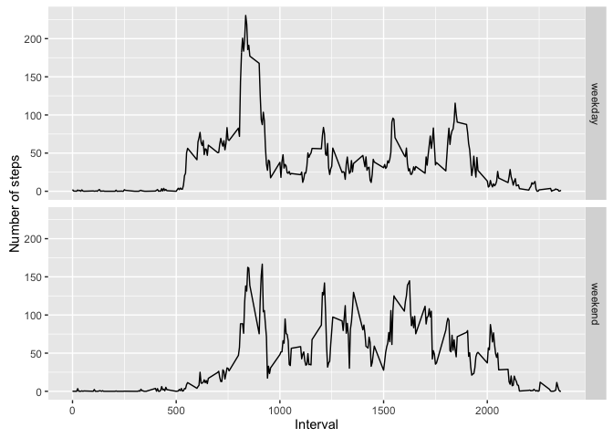

# Reproducible Research: Peer Assessment 1


## Loading and preprocessing the data

```r
library(data.table)
library(lubridate)
filename <- "./activity.csv"
if(!file.exists(filename)) {
    unzip("./activity.zip")
}
dataset <- fread(filename, header = TRUE, na.strings = "NA")
dataset$date <- ymd(dataset$date)
```


## What is mean total number of steps taken per day?

```r
library(dplyr)
totalStepsPerDay <- dataset %>%
    group_by(date) %>%
    summarise(total = sum(steps, na.rm = TRUE))
mean(totalStepsPerDay$total)
```

```
## [1] 9354.23
```

```r
median(totalStepsPerDay$total)
```

```
## [1] 10395
```

## What is the average daily activity pattern?

```r
library(ggplot2)
averageSteps <- dataset %>%
    group_by(interval) %>%
    summarise(avg = mean(steps, na.rm = TRUE))
ggplot(averageSteps, aes(interval, avg)) +
    geom_line() +
    ylab("average number of steps")
```

<!-- -->

```r
# max of average or just another value for max?
maximumAVGNumberOfSteps <- averageSteps %>%
    filter(avg == max(averageSteps$avg))
print(maximumAVGNumberOfSteps$interval)
```

```
## [1] 835
```


## Imputing missing values
Total missing values in the dataset, only steps that have missing values.

```r
nrow(dataset[!complete.cases(dataset$steps)])
```

```
## [1] 2304
```
Find mean of the days

```r
meanStepsPerInterval <- dataset %>%
    group_by(interval) %>%
    summarise(mean = mean(steps, na.rm = TRUE))

# given steps and interval, find the return the median from meanStepsPerInterval
getMeanStepsFromInterval <- function(steps, interval) {
    if (is.na(steps)) {
    return(meanStepsPerInterval$mean[meanStepsPerInterval$interval == interval])
    }
    return(steps)
}

completeDataset <- dataset
completeDataset$steps <- mapply(getMeanStepsFromInterval, dataset$steps, dataset$interval)
completeTotalStepsPerDay <- completeDataset %>%
    group_by(date) %>%
    summarise(steps = sum(steps, na.rm = TRUE))
qplot(completeTotalStepsPerDay$steps, geom = "histogram", xlab = "total number of steps taken each day")
```

<!-- -->

`mean` and `median` are different from dataset in the first part.  
Apperently, imputing missing data increase both mean and median of the dataset.

```r
mean(completeTotalStepsPerDay$steps)
```

```
## [1] 10766.19
```

```r
median(completeTotalStepsPerDay$steps)
```

```
## [1] 10766.19
```


## Are there differences in activity patterns between weekdays and weekends?

```r
# given a date return if it's in a weekday or weekend
getDayType <- function(date) {
    weekdayName <- weekdays(date)
    if (weekdayName %in% c("Saturday", "Sunday")) {
    return("weekend")
    }
    return("weekday")
}
completeDataset$day <- sapply(completeDataset$date, getDayType)

averageStepsByInterval <-
    aggregate(steps ~ interval + day, data = completeDataset, mean)
ggplot(averageStepsByInterval, aes(interval, steps)) +
    geom_line() +
    facet_grid(day ~ .) + 
    ylab("Number of steps") +
    xlab("Interval")
```

<!-- -->

